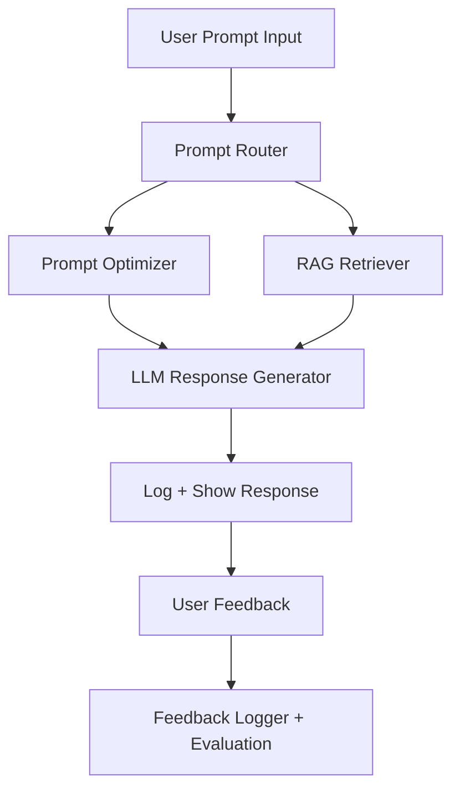

# 🤖 PromptPal: AI Agent Assistant with RAG + Prompt Tools

## 📄 Abstract

PromptPal is a cutting-edge AI assistant that blends prompt engineering, Retrieval-Augmented Generation (RAG), and user feedback loops to optimize large language model (LLM) interactions. Built with FastAPI, LangChain, and vector stores like FAISS, it allows users to ask questions, retrieve document-based facts, and receive improved responses — all while collecting feedback to refine performance over time. The platform is fully containerized with Docker and deployable via GitHub Actions, ensuring seamless updates and scalability.

## 📝 Introduction

PromptPal addresses a growing need for intelligent LLM systems that not only generate coherent text but also reference accurate sources and adapt through feedback. Many AI systems today operate as static black boxes. PromptPal introduces transparency, adaptability, and optimization by integrating prompt refinement and document-based fact retrieval.

### 🔍 Key Objectives:
- Optimize prompts using intelligent prompt engineering.
- Use RAG to fetch factual answers from uploaded documents.
- Store interactions and feedback in a SQLite database.
- Enable a feedback loop for continuous prompt improvement.
- Deploy using Docker and GitHub Actions for full CI/CD flow.

---

## 🔧 Technologies and Tools

### 🔹 Core Stack:
- **Python** — main development language.
- **FastAPI** — for backend API.
- **LangChain** — to orchestrate prompt tools and RAG logic.
- **FAISS** — as the vector store for document retrieval.
- **Docker** — containerization and consistent environment.
- **GitHub Actions** — CI/CD pipeline.
- **SQLite** — lightweight local database for logging and feedback.

### 🔹 LLMs:
- **Ollama + Mistral** — local LLM setup.
- **OpenAI GPT-4** — optional cloud LLM integration.

### 🔹 Libraries:
- `transformers`, `sentence-transformers`
- `langchain`, `pydantic`, `uvicorn`
- `sqlite3`, `dotenv`, `faiss-cpu`

---

## 🚀 Proposed System

The PromptPal pipeline consists of:

- **Unified Chat Module**: Users submit prompts with specific intent.
- **Prompt Optimization**: Enhances prompts when intent is "improvement".
- **RAG Retriever**: Pulls relevant documents for "ask_doc" intent.
- **LLM Inference**: Sends the optimized prompt to the selected LLM.
- **Feedback System**: Captures user feedback to improve future interactions.
- **Logger**: Stores all interactions, responses, and ratings.

---

## ⚙️ System Architecture

## 💻 Implementation

### 🔹 A) Unified Chat Flow

The `/unified_chat` API route handles all incoming user prompts. It performs different operations based on the `intent` field:

- Accepts both `prompt` and `intent` in a JSON body.
- Optimizes the prompt if `intent == "prompt_improvement"`.
- Uses RAG (Retrieval-Augmented Generation) if `intent == "ask_doc"`.
- Sends the final prompt to the Mistral or OpenAI backend LLM.

### 🔹 B) Prompt Optimizer

This module improves prompt clarity and effectiveness by applying custom rewriting techniques grounded in prompt engineering principles.

- Applies proven prompt engineering patterns to rephrase or expand input prompts.
- Logs both the original and optimized prompts for side-by-side analysis.
- Uses RAG (Retrieval-Augmented Generation) if `intent == "ask_doc"`.
- Seamlessly integrates into the feedback loop to learn and evolve from user ratings.

### 🔹 C) RAG Module

This component enables document-based answering using FAISS and LangChain.

- Converts user prompt into vector embeddings.
- Retrieves top 3 most similar document chunks from the FAISS index.
- Prepends these chunks to the prompt before LLM inference.
- Enables accurate, source-grounded answers.

### 🔹 C) Feedback & Logging System

This module handles interaction logging and user feedback storage using a lightweight SQLite database. It captures each stage of the prompt processing flow—enabling transparency, traceability, and feedback-driven improvement.

🗃️ Database: prompt_logs
Each interaction is logged in the prompt_logs table

- Logs every interaction with relevant metadata.
- Stores both raw and optimized prompt-response pairs.
- Collects user feedback to continuously refine prompt optimization.
- Supports future model evaluation and prompt tuning based on feedback.
