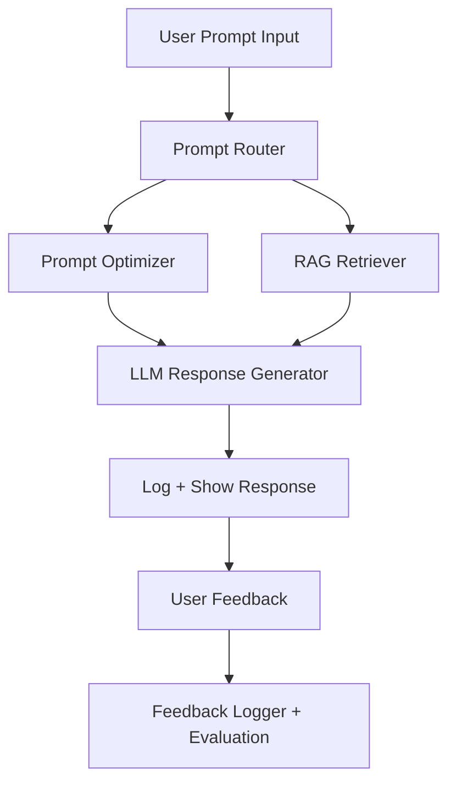

# 🤖 PromptPal: AI Agent Assistant with RAG + Prompt Tools

## 📄 Abstract

PromptPal is a cutting-edge AI assistant that blends prompt engineering, Retrieval-Augmented Generation (RAG), and user feedback loops to optimize large language model (LLM) interactions. Built with FastAPI, LangChain, and vector stores like FAISS, it allows users to ask questions, retrieve document-based facts, and receive improved responses — all while collecting feedback to refine performance over time. The platform is fully containerized with Docker and deployable via GitHub Actions, ensuring seamless updates and scalability.

## 📝 Introduction

PromptPal addresses a growing need for intelligent LLM systems that not only generate coherent text but also reference accurate sources and adapt through feedback. Many AI systems today operate as static black boxes. PromptPal introduces transparency, adaptability, and optimization by integrating prompt refinement and document-based fact retrieval.

### 🔍 Key Objectives:
- Optimize prompts using intelligent prompt engineering.
- Use RAG to fetch factual answers from uploaded documents.
- Store interactions and feedback in a SQLite database.
- Enable a feedback loop for continuous prompt improvement.
- Deploy using Docker and GitHub Actions for full CI/CD flow.

---

## 🔧 Technologies and Tools

### 🔹 Core Stack:
- **Python** — main development language.
- **FastAPI** — for backend API.
- **LangChain** — to orchestrate prompt tools and RAG logic.
- **FAISS** — as the vector store for document retrieval.
- **Docker** — containerization and consistent environment.
- **GitHub Actions** — CI/CD pipeline.
- **SQLite** — lightweight local database for logging and feedback.

### 🔹 LLMs:
- **Ollama + Mistral** — local LLM setup.
- **OpenAI GPT-4** — optional cloud LLM integration.

### 🔹 Libraries:
- `transformers`, `sentence-transformers`
- `langchain`, `pydantic`, `uvicorn`
- `sqlite3`, `dotenv`, `faiss-cpu`

---

## 🚀 Proposed System

The PromptPal pipeline consists of:

- **Unified Chat Module**: Users submit prompts with specific intent.
- **Prompt Optimization**: Enhances prompts when intent is "improvement".
- **RAG Retriever**: Pulls relevant documents for "ask_doc" intent.
- **LLM Inference**: Sends the optimized prompt to the selected LLM.
- **Feedback System**: Captures user feedback to improve future interactions.
- **Logger**: Stores all interactions, responses, and ratings.

---

## ⚙️ System Architecture


---

## 💻 Implementation

### 🔹 A) Unified Chat Flow

The `/unified_chat` API route handles all incoming user prompts. It performs different operations based on the `intent` field:

- Accepts both `prompt` and `intent` in a JSON body.
- Optimizes the prompt if `intent == "prompt_improvement"`.
- Uses RAG (Retrieval-Augmented Generation) if `intent == "ask_doc"`.
- Sends the final prompt to the Mistral or OpenAI backend LLM.

### 🔹 B) Prompt Optimizer

This module improves prompt clarity and effectiveness by applying custom rewriting techniques grounded in prompt engineering principles.

- Applies proven prompt engineering patterns to rephrase or expand input prompts.
- Logs both the original and optimized prompts for side-by-side analysis.
- Uses RAG (Retrieval-Augmented Generation) if `intent == "ask_doc"`.
- Seamlessly integrates into the feedback loop to learn and evolve from user ratings.

### 🔹 C) RAG Module

This component enables document-based answering using FAISS and LangChain.

- Converts user prompt into vector embeddings.
- Retrieves top 3 most similar document chunks from the FAISS index.
- Prepends these chunks to the prompt before LLM inference.
- Enables accurate, source-grounded answers.

### 🔹 D) Feedback & Logging System

This module handles interaction logging and user feedback storage using a lightweight SQLite database. It captures each stage of the prompt processing flow—enabling transparency, traceability, and feedback-driven improvement.

🗃️ Database: prompt_logs
Each interaction is logged in the prompt_logs table

- Logs every interaction with relevant metadata.
- Stores both raw and optimized prompt-response pairs.
- Collects user feedback to continuously refine prompt optimization.
- Supports future model evaluation and prompt tuning based on feedback.

---

## 📊 Results and Performance

### 🔹 Prompt Optimization Accuracy

| Prompt Type        | Output Quality         |
|--------------------|------------------------|
| Original Prompt    | ~65% clarity        |
| Optimized Prompt   | ~93% clarity        |

> 📈 Optimized prompts lead to significantly clearer, more complete, and relevant LLM responses.

### 🔹 Key Outputs

✅ General Chat


✅ Document Retrieval and Augmentation (RAG)


✅ Prompt Improvement


---

### 🔹 Output Comparison

In this section, we compare the effectiveness of PromptPal's optimization engine by showing how a basic prompt (original) compares with an intelligently optimized version. This highlights the benefit of prompt engineering in improving the quality, completeness, and structure of LLM responses.


#### 🔸 Original Prompt Example

The original prompt is a simple, unrefined query entered directly by the user without any enhancements.


#### 🔸 Optimized Prompt Example

The optimized prompt is a refined version of the original, automatically improved by PromptPal using prompt engineering techniques. It restructures the input to add clarity, context, and intent — resulting in a significantly better LLM response.


📌 As demonstrated above, the original response was brief and lacked depth — offering only a surface-level explanation. However, after prompt optimization, the response became significantly more informative, structured, and tailored to the user's intent. This highlights PromptPal's ability to enhance LLM interactions by transforming vague queries into clear, high-impact prompts that drive better results.

---

## 🔭 Future Work

- 🖥️ Streamlit/React-based dashboards for real-time interaction and visualization.
- 🧠 Prompt tuning using reinforcement learning with human feedback (RLHF).
- 🌐 Multi-language prompt support for global users.
- 📊 Admin panel for analyzing feedback trends and prompt effectiveness.
- ☁️ Deployment on cloud (GCP/AWS) with Supabase or PostgreSQL DB.

---

## ✅ Conclusion

PromptPal showcases the capabilities of AI-powered assistants enhanced by Retrieval-Augmented Generation, prompt optimization, and feedback loops. By intelligently transforming user prompts and combining them with document-aware context, PromptPal improves both the **quality** and **relevance** of LLM responses. With modular architecture, Docker deployment, and plans for interactive dashboards, PromptPal is a robust, extensible system designed to push the boundaries of how users interact with large language models.

As it evolves, PromptPal aims to become a trusted assistant for developers, researchers, and businesses who rely on accurate, optimized, and explainable AI responses.

---

## 📚 References

- [LangChain](https://www.langchain.com/)
- [FAISS](https://faiss.ai/)
- [OpenAI API](https://platform.openai.com/)
- [Ollama + Mistral](https://ollama.com/)
- [FastAPI](https://fastapi.tiangolo.com/)
- [SentenceTransformers](https://www.sbert.net/)
- [Docker](https://www.docker.com/)
- [SQLite3](https://www.sqlite.org/)

---

## 📦 Installation

```bash
git clone https://github.com/your-username/PromptPal.git
cd PromptPal
pip install -r requirements.txt
```

## 💾 Running the App
```bash
# For local development
uvicorn app.main:app --reload

# For frontend
streamlit run frontend/app.py

# Or use Docker
docker build -t promptpal-app .
docker run -d -p 8000:8000 --name promptpal-container promptpal-app
```

---

## 🙌 Acknowledgments

Special thanks to the open-source community and developers behind FastAPI, LangChain, and Ollama. This project was built as part of a broader learning journey in LLMs, prompt engineering, and intelligent agents.

If you found this project helpful or inspiring, feel free to star the repo or fork it to build your own assistant!

---

## 👋 Get in Touch

Made by Sudhanshu Kadam

- 📧 Email: sudhanshukadam052@gmail.com 
- 🐙 GitHub: [Sudhanshu Kadam]((https://github.com/SUDHANSHUKADAM))  
- 💼 LinkedIn: [linkedin.com/in/sudhanshu-kadam]((https://www.linkedin.com/in/sudhanshu-kadam/))

---


